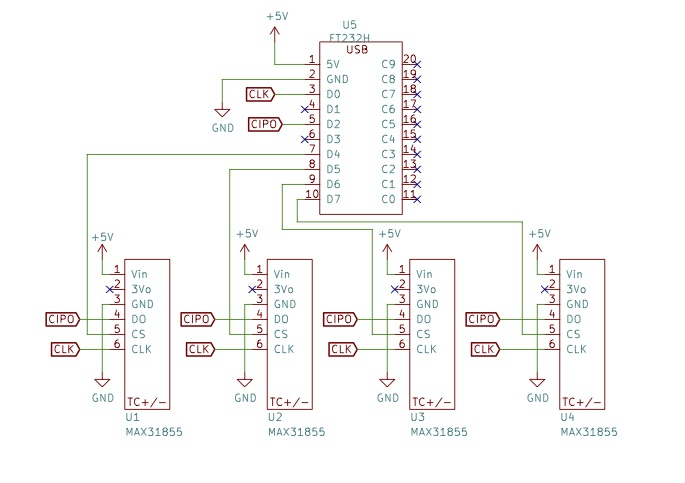
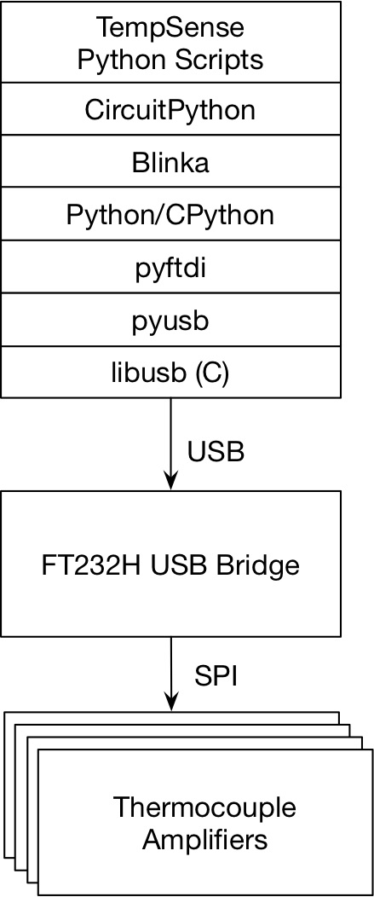
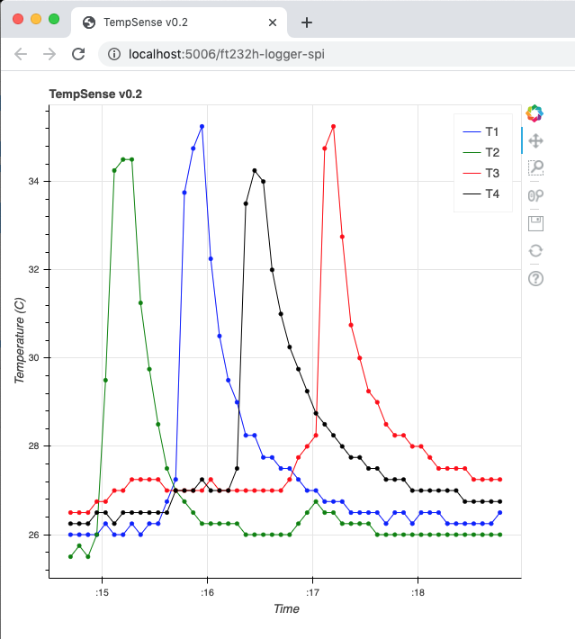

# Hardware in context

Temperature measurements and time series support the efficient use of energy and efforts to combat climate change.
Scaling these efforts requires the wide use of temperature sensor technologies for buildings and industrial processes and an understanding of temperature sensor instruments and data collection.
However, my conversations with energy practitioners indicate that these instruments are underutilized and often not installed properly, making the data they collect impossible to interpret.
To address these issues, more professionals need experience in collecting temperature time series early in their training.
The instrument was developed as a demonstration tool for students preparing for energy careers to help them integrate physical observations with real-time visualizations and data collection.
This instrument is well suited for energy and building-science classroom demonstrations and laboratory use, and also to general temperature logging measurements.

Existing rugged and reliable multi-channel temperature sensors of high quality exist but have relatively high price points (300--500 USD) and are not easily extended, creating a niche for this instrument.
The Omega HH1385, a four-input thermometer with a USB interface for Microsoft Windows systems and data logging capabilities, sells for 425 USD and the Extech SDL200, a 4-channel data logger for thermocouples with data logging to an SD card, sells for 360 USD.
A set of four inexpensive thermocouples for each of these would add 40--50 USD in cost.
The Pax Instruments T400 device, a 4-channel standalone logger using thermocouples with a USB interface and open hardware and software, sold for 175 USD but was discontinued.

These price points and limited extensibility present a dual opportunity to create a low-cost temperature sensor with customization that is accessible to novices.
The hardware design decisions for this instrument support three main objectives: affordability, extensibility, and approachability.
Meeting these objectives provides a convenient and cost effective temperature logger that introduces learners to scientific instruments and visualization through an approachable open-source design.

# Hardware description

Several of the design decisions lower costs to support affordability.
The use of a host computer and USB bridge removes the need for a microcontroller and supplies power via USB eliminating a battery supply.
Since the instrument is designed for stationary monitoring situations, we include no rugged case and have minimized circuit board area to reduce cost.
The instrument uses widely available thermocouples and a thermocouple amplifier circuit board where through-hole soldering performed by the end user reduces cost.

The use of a USB bridge with a CircuitPython interface provides a highly extensible platform.
The USB bridge allows communication with the digital interface of the thermocouple amplifiers using Python commands on the host computer without the need for byte-level code.
Normally this would be done by a microcontroller in the instrument, requiring code both on the instrument and the computer for data analysis and visualization.
In contrast, this instrument requires only one script with machine instructions and any modification or extension would be to a single code base rather than two.
The CircuitPython library provides compatibility with all Python libraries allowing a rich set of graphing, communication, and internet libraries to be integrated with the instrument.
Data can be sent to a database, setpoint or max/min alarms can be sent by email or text message, and real-time visualizations can be constructed.

Several design decisions were made to allow learners to understand the operation of the device and provide opportunities to extend and customize the device.
Learners are often coding novices, and the Python language is a widely-taught and approachable language.
We write the instrument code in a style that favors clarity for learners over compactness, performance, or idioms.
Instrument code that only generates text output is provided as a minimal working example showing the use of the instrument.
We also include instrument code that provides real-time graphing that can be customized once learners understand the basic operation of the instrument.
To help students verify the signal paths of the thermocouples, the traces used to select each chip for communication are clearly visible on the front of the circuit board and the circuit schematic is relatively simple.

This instrument offers several advantages relative to existing instruments.
The BOM cost is below 150 USD, lower than the other 4-channel instruments cited above.
The Omega and Extech instruments have data logging, but don't provide a multiplatform path to stream data.
Pasco provides instruments that stream data and are extensible but these use proprietary software platforms.
Providing these benefits created some tradeoffs.
The instrument requires a host computer, has no case, and is much less portable as a result.
Setting up the device requires Python and USB library installations and an environment variable configuration on the host computer which can be bewildering to new users.

