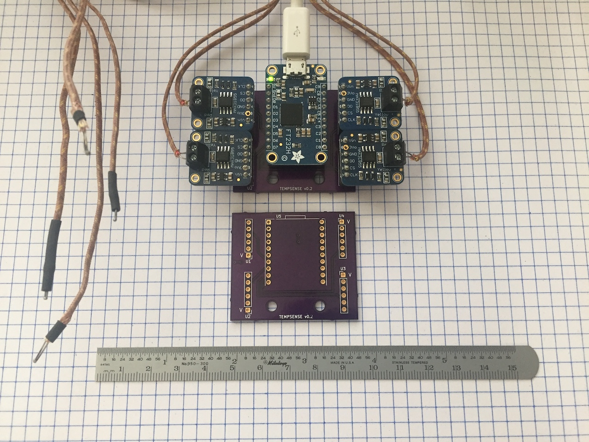
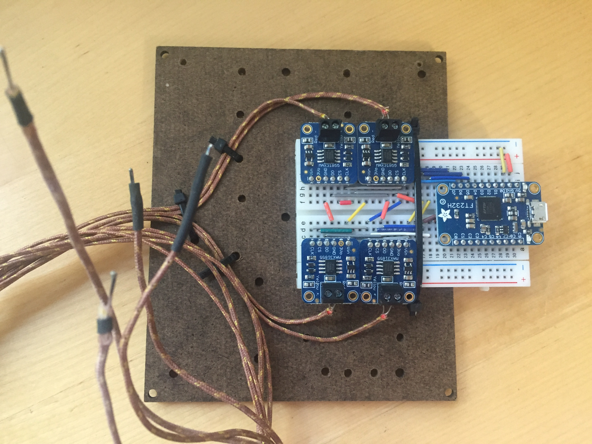

# TempSense Temperature Sensor

The first goal of the project is to provide a convenient and cost-effective logger for temperature observations in classrooms or laboratories.
The second goal of the project is to create an accessible introduction to scientific instruments and visualization through a highly-scaffolded open source hardware/software project.

This repository contains the specifications and schematics for the hardware, software to log temperatures, and potential lessons for students.

The hardware in this project is licensed under CERN-OHL-P v2.

The software in this project is licensed under MIT.

The documentation in this project is licensed under CC-BY 4.0.