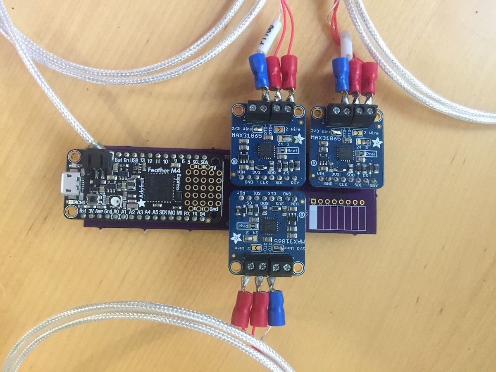

# Temperature Sensor 

The first goal of the project is to provide a convenient and cost-effective logger for temperature observations in classrooms or laboratories.
The second goal of the project is to create an accessible introduction to scientific instruments and visualization through a highly-scaffolded open source hardware/software project.

This repository contains the specifications and schematics for the hardware, software to log temperatures, and potential lessons for students.

This work is licensed under a
[Creative Commons Attribution 4.0 International License](http://creativecommons.org/licenses/by/4.0)